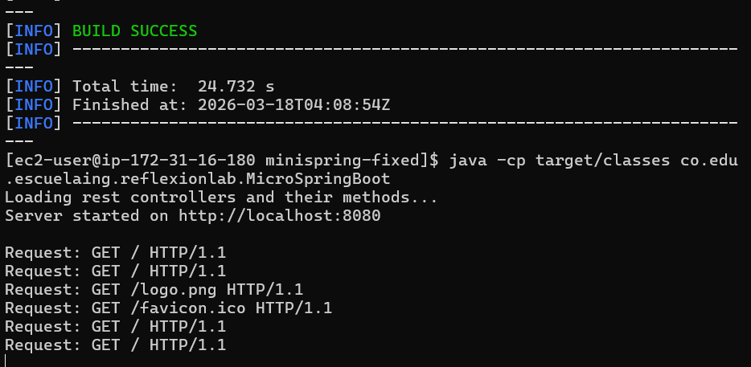
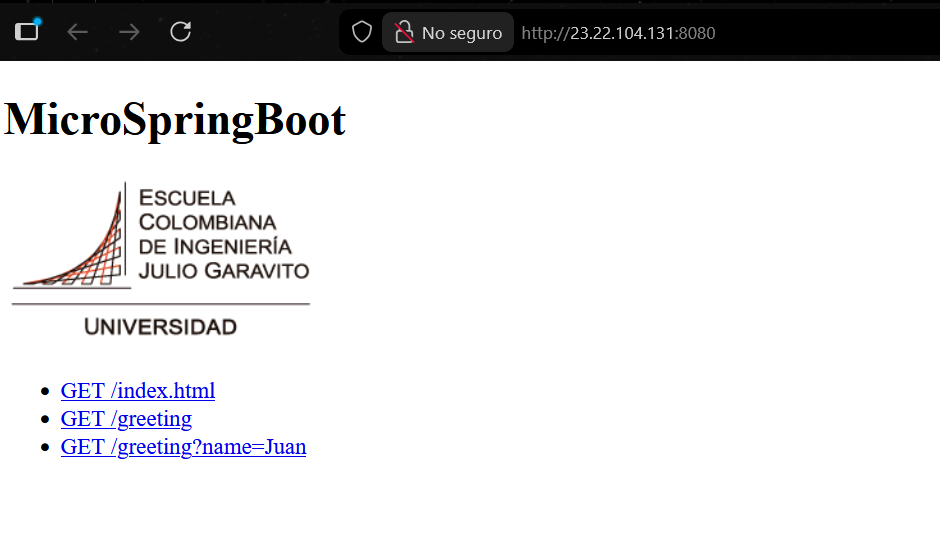
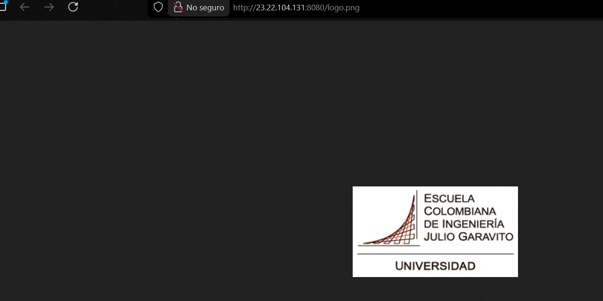
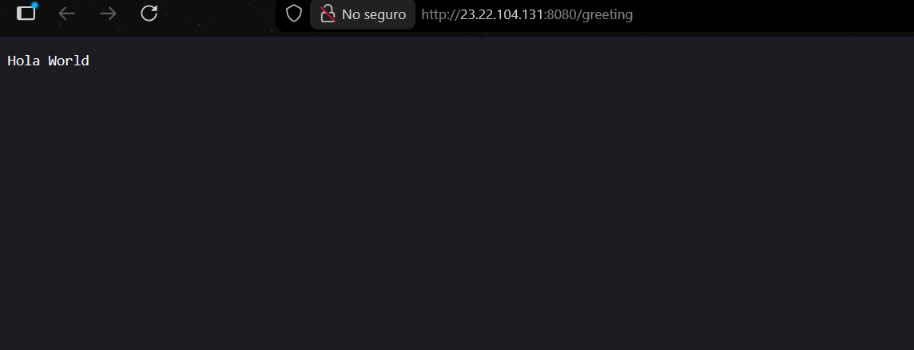
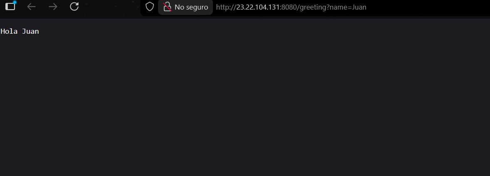

# MicroSpringBoot

Un framework IoC ligero para Java que permite la construcción de servidores web (tipo Apache) a partir de POJOs, demostrando las capacidades reflexivas del lenguaje Java.

## Descripción del Proyecto

Este proyecto implementa un servidor web en Java que:

1. **Entrega contenido estático**: HTML e imágenes PNG desde el classpath
2. **Framework IoC con reflexión**: Carga y registra automáticamente componentes anotados con `@RestController`
3. **REST controllers**: Mapeo de métodos HTTP GET mediante anotación `@GetMapping`
4. **Parámetros de solicitud**: Soporte de `@RequestParam` con valores por defecto
5. **Manejo de múltiples solicitudes**: Servidor secuencial que atiende solicitudes no concurrentes

## Requisitos

- **Java 17 o superior** (compilado con Java 17)
- **Apache Maven 3.6.0 o superior**

## Estructura del Proyecto

```
minispring-fixed/
├── pom.xml                                      # Configuración Maven
├── src/
│   ├── main/
│   │   ├── java/co/edu/escuelaing/reflexionlab/
│   │   │   ├── MicroSpringBoot.java            # Núcleo del framework
│   │   │   ├── annotations/
│   │   │   │   ├── RestController.java         # Anotación para componentes
│   │   │   │   ├── GetMapping.java             # Anotación para mapeos HTTP
│   │   │   │   └── RequestParam.java           # Anotación para parámetros
│   │   │   └── controllers/
│   │   │       ├── HelloController.java        # Controlador de ejemplo
│   │   │       └── GreetingController.java     # Controlador con @RequestParam
│   │   └── resources/webroot/
│   │       ├── index.html                      # Página estática
│   │       └── logo.png                        # Imagen PNG
│   └── test/...
└── target/                                      # Artefactos compilados
```

## Compilación

```bash
mvn clean package
```

Este comando:
- Compila el código Java
- Ejecuta pruebas
- Genera el JAR empaquetado
- Copia dependencias a `target/dependency/`

## Ejecución

### Opción 1: Desde classpath (escaneo automático)
```bash
java -cp target/classes co.edu.escuelaing.reflexionlab.MicroSpringBoot
```
El servidor detecta automáticamente todos los componentes `@RestController` en el classpath.

### Opción 2: Con carga explícita de controladores
```bash
java -cp target/classes co.edu.escuelaing.reflexionlab.MicroSpringBoot \
    co.edu.escuelaing.reflexionlab.controllers.HelloController \
    co.edu.escuelaing.reflexionlab.controllers.GreetingController
```

### Opción 3: Desde JAR empaquetado
```bash
java -jar target/minispring-1.0-SNAPSHOT.jar
```

El servidor escuchará en `http://localhost:8080`

## Ejemplos de Uso

Una vez que el servidor está ejecutándose:

### Página estática HTML
```bash
curl http://localhost:8080/
```
Respuesta: Página HTML con enlaces a servicios disponibles

### Imagen PNG
```bash
curl http://localhost:8080/logo.png
```
Respuesta: Archivo PNG (logo de la Universidad)

### GET con parámetro por defecto
```bash
curl http://localhost:8080/greeting
```
Respuesta: `Hola World`

### GET con parámetro personalizado
```bash
curl http://localhost:8080/greeting?name=Juan
```
Respuesta: `Hola Juan`

## Implementación del Framework

### Anotaciones

#### @RestController
Marca una clase como componente REST que será registrado automáticamente.
```java
@RestController
public class HelloController {
    // Métodos mapeados con @GetMapping
}
```

#### @GetMapping
Mapea un método a una ruta HTTP GET.
```java
@GetMapping("/greeting")
public String greeting() {
    return "Hola Mundo";
}
```

#### @RequestParam
Extrae parámetros de la query string con soporte a valores por defecto.
```java
@RequestParam(value = "name", defaultValue = "World")
String name
```

### Ciclo de vida del framework

1. **Inicialización** (`main`):
   - Lee línea de comandos para controladores explícitos
   - O realiza escaneo automático del classpath

2. **Carga de controladores** (`loadController`):
   - Carga clase especificada
   - Verifica anotación `@RestController`
   - Instancia el componente
   - Registra todos sus métodos con `@GetMapping`

3. **Escaneo automático** (`scanAndLoad`):
   - Recorre el classpath
   - Busca archivos `.class`
   - Carga dinámicamente clases con `@RestController`

4. **Manejo de solicitudes** (`handleRequest`):
   - Lee solicitud HTTP GET
   - Extrae ruta y parámetros
   - Busca controlador mapeado
   - Resuelve argumentos del método (`@RequestParam`)
   - Invoca método usando reflexión
   - Envía respuesta HTTP

5. **Servicio de archivos estáticos** (`serveStaticFile`):
   - Busca recurso en `/webroot` del classpath
   - Detecta MIME type según extensión
   - Envía contenido con headers HTTP apropiados

## Características Soportadas

Servidor web HTTP en Java  
Entrega de HTML e imágenes PNG  
Framework IoC con reflexión Java  
Carga automática de componentes `@RestController`  
Mapeo de rutas con `@GetMapping`  
Parámetros de query con `@RequestParam`  
Valores por defecto en parámetros  
Manejo de múltiples solicitudes (secuencial)  
Compilación y empaquetamiento con Maven  
JAR ejecutable directamente  

## Despliegue en AWS

El proyecto ha sido desplegado en una instancia EC2 de Amazon Linux 2023:

1. **Instancia**: ec2-user en 23.22.104.131
2. **Puerto**: 8080 (abierto en Security Group)
3. **Servicio**: Ejecutando `java -cp target/classes co.edu.escuelaing.reflexionlab.MicroSpringBoot`

### Pruebas en AWS

- **Raíz**: http://23.22.104.131:8080/ → Entrega index.html con logo PNG
- **Imagen**: http://23.22.104.131:8080/logo.png → PNG de Universidad
- **API 1**: http://23.22.104.131:8080/greeting → "Hola World"
- **API 2**: http://23.22.104.131:8080/greeting?name=Juan → "Hola Juan"

Todas las solicitudes responden con código HTTP 200 OK.

## Ciclo de vida Maven

El proyecto define el siguiente ciclo de vida:

```xml
<build>
  <plugins>
    <!-- maven-compiler-plugin: Compila Java 17 a bytecode Java 17 -->
    <!-- maven-jar-plugin: Genera JAR con manifest correcto -->
    <!-- maven-dependency-plugin: Copia dependencias a target/dependency -->
  </plugins>
</build>
```

Comando de compilación completo:
```bash
mvn clean package
```

Resultado:
- `target/classes/` → Bytecode compilado
- `target/minispring-1.0-SNAPSHOT.jar` → JAR ejecutable
- `target/dependency/` → Dependencias (JUnit, etc.)

## Controladores de Ejemplo

### HelloController
```java
@RestController
public class HelloController {
    @GetMapping("/")
    public static String index() {
        return "Greetings from Spring Boot!";
    }
}
```

### GreetingController
```java
@RestController
public class GreetingController {
    private static final String template = "Hello, %s!";
    private final AtomicLong counter = new AtomicLong();

    @GetMapping("/greeting")
    public String greeting(@RequestParam(value = "name", defaultValue = "World") String name) {
        return "Hola " + name;
    }
}
```

## Detalles Técnicos

- **Modelo de concurrencia**: Secuencial (una solicitud por vez)
- **Reflexión**: Uso de `java.lang.reflect.*` para inspección de clases
- **ClassLoading**: Dinámico mediante `Class.forName()` y escaneo de classpath
- **HTTP/1.1**: Protocolo simple sobre sockets TCP
- **MIME types**: Detectados automáticamente por extensión de archivo
- **Encoding**: UTF-8 para texto, binario para imágenes

## Autor

Juan Manuel Villegas Medina 
Escuela Colombiana de Ingeniería Julio Garavito  
Marzo de 2026

# Evidencia del despliegue









